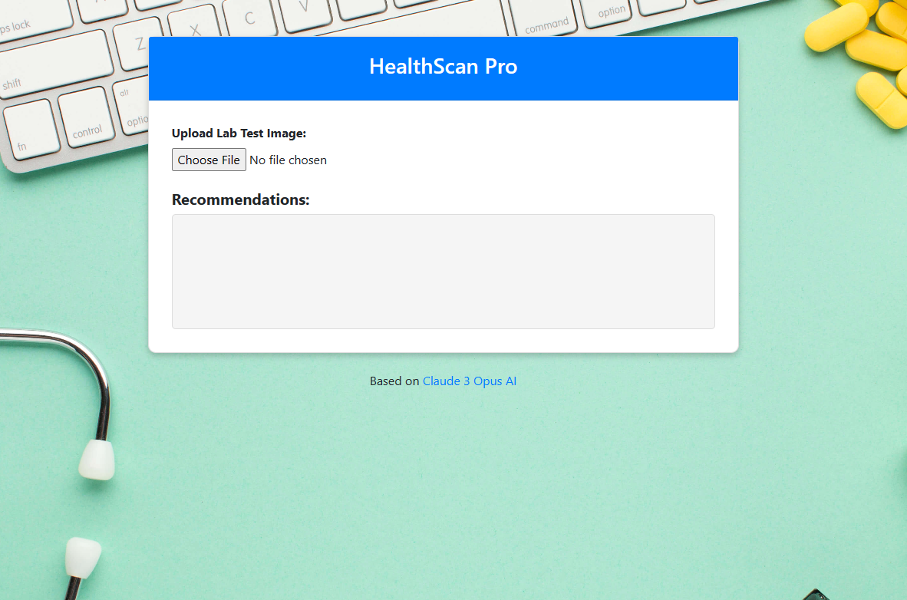
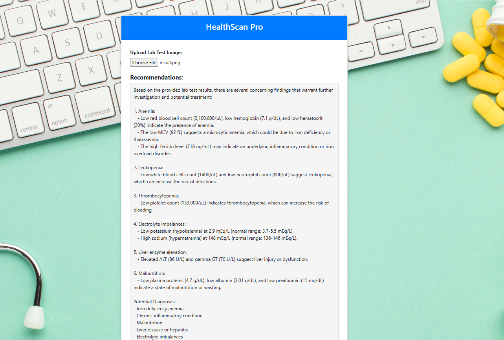

# Health-Scan Pro

Health-Scan Pro is a web application designed to assist healthcare professionals in analyzing lab test results. By uploading lab test images, the application extracts text from the images and generates detailed recommendations based on the extracted information.

## Features

The application allows users to upload lab test images and extract text from them using Tesseract OCR. It then generates comprehensive recommendations using the Anthropic API powered by Claude 3 Opus AI. The web interface is user-friendly and works seamlessly across desktop and mobile devices.
  
## Usage

1. Navigate to the HealthScan Pro web application.
2. Upload a lab test image using the provided file upload input.
3. Wait for the application to process the image and generate recommendations.
4. View the generated recommendations displayed on the page.

## Preview

---

## Contributing

Contributions are welcome! If you'd like to contribute to HealthScan Pro, please follow these steps:

1. Fork the repository.
2. Create a new branch for your feature or bug fix: `git checkout -b feature-name`.
3. Make your changes and commit them: `git commit -m 'Add new feature'`.
4. Push to the branch: `git push origin feature-name`.
5. Submit a pull request with a description of your changes.

## License

This project is licensed under the MIT License.

## Acknowledgments

- Claude 3 Opus AI by [Anthropic](https://claude.ai/chats)
